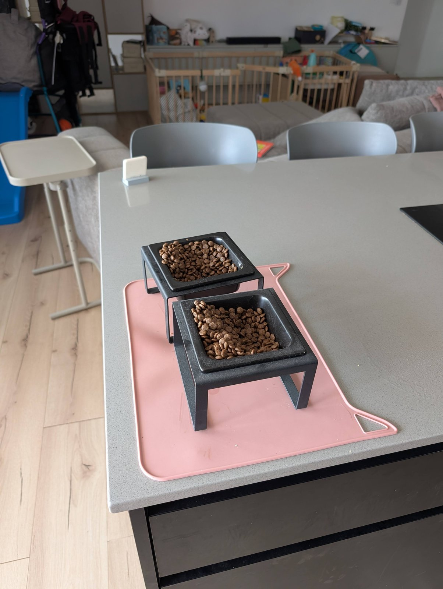
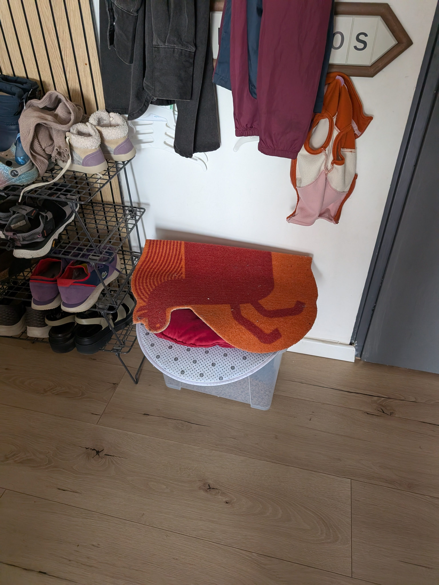
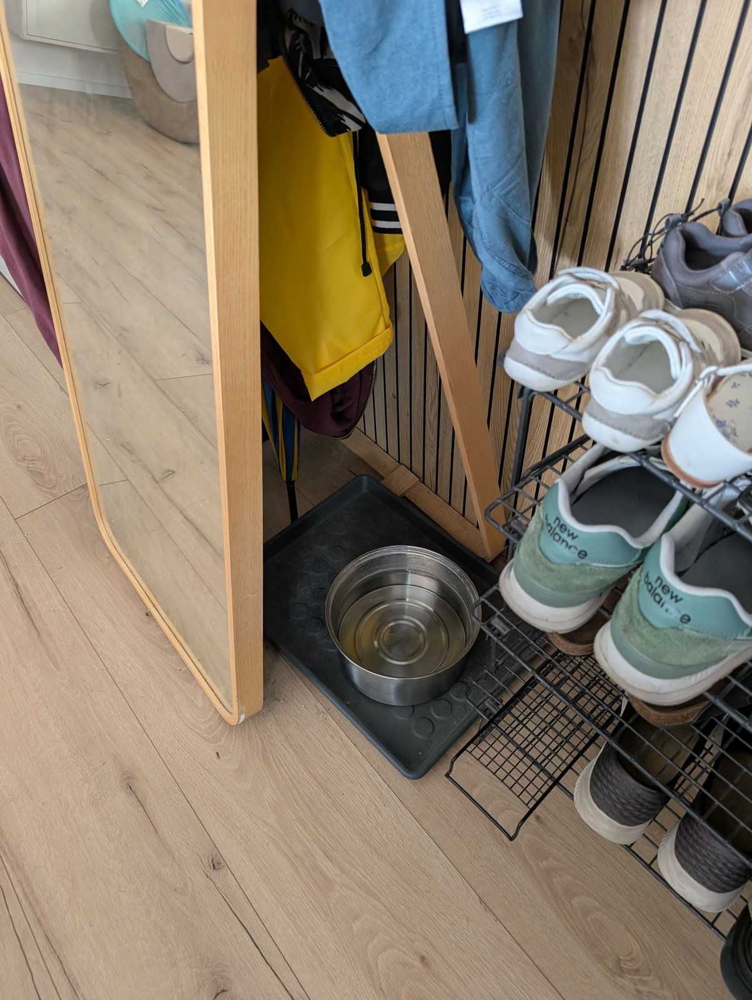
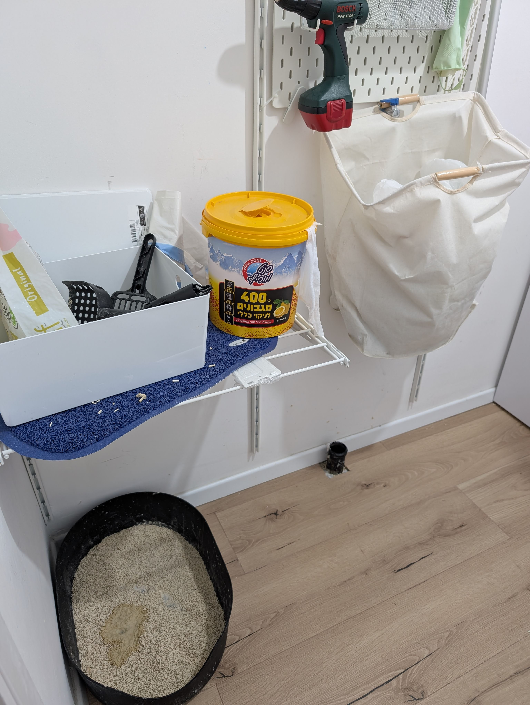
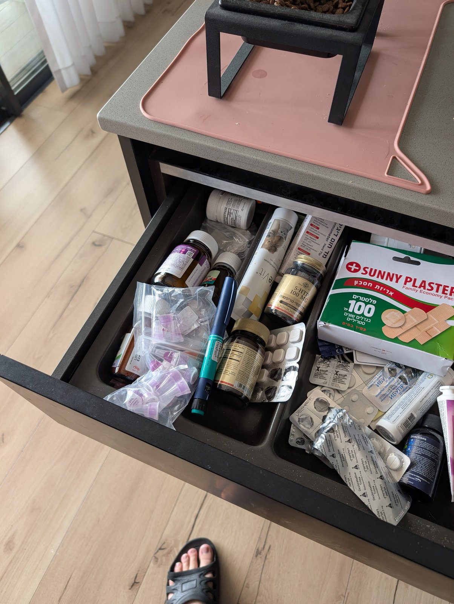

# cats-guide

Уход за котами — пока мы в отпуске.

Каждый день — 4 дела:

1. [Доложить еды](#1-доложить-еды)
2. [Поменять воду](#2-поменять-воду)
3. [Убрать туалет](#3-убрать-туалет)
4. [Сделать укол старшему коту](#4-сделать-укол-старшему-коту)

## 1. Доложить еды

Обе миски должны быть полны до краёв — еда у котов не лимитируется.

Еда берётся из контейнера у входа.

## 2. Поменять воду

Две поилки:

- Одна за зеркалом.
- Вторая в ванной.

Наливать из-под крана (можно из фильтра, можно просто из раковины).
Менять можно через день.

## 3. Убрать туалет

Совочком всё скинуть в пакетики (пакеты в белой сумке справа).
Пакетик — в мусорку у кухонного острова.

## 4. Сделать укол старшему коту

Чёрному коту сделать укол из шприца — 4 юнита.

Каждый день менять иголку и выкидывать старую.
Иголки и шприц лежат в левом верхнем ящике в обеденном острове.

